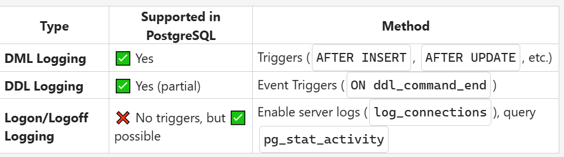

# Day 5

## Sessions

### Morning 

- Postgresql Installation and configure
- Practice questions on DVD_rental database
- Cursors
- Triggers
- Transaction

### Afternoon

- Task related to cursors, triggers and transaction

## Cursors

- Tool handling data row by row rather than working with complete result sets.

### Lifecycle

- Declare
- Open
- Fetch
- Close
- End

## Types of Cursors

- `static` - Takes snapshot of data and doesn't reflect changes
- `dynamic` - Reflects all changes
- `keyset` - Shows up updated and deletes but not new rows
- `fast_forward` - fast, forward only, read only (optimized type)

## Locktype

- Read_only
- Scroll_only
- Optimistic

## Trigger

- It is a database callback function that is automatically executed in response to certain events on a table.
- It can be fired `before`, `after` or `specific`.

## Transaction

- It is a sequence of one or more sql operations in a single unit of work

### Control Statements

- `Begin` - Starts a new transaction.
- `Commit` - Saves all changes made in the transaction.
- `Rollback` - Undoes all changes made in the transaction.
- `Savepoint` - Sets a point you can roll back to within a transaction.
- `Rollback To savepoint` - Rolls back part of the transaction to a savepoint.

_learned some other concepts also and implement it in the task_