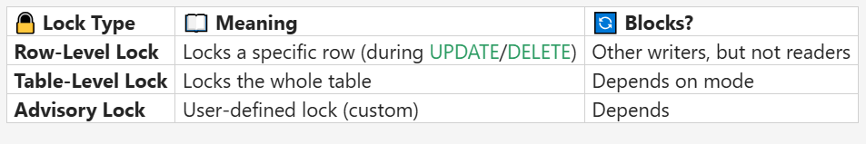
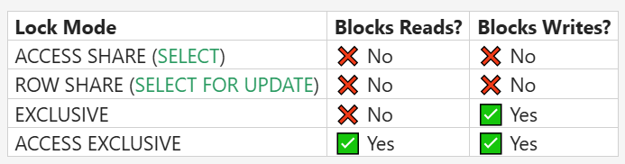

# Day 7

## Sessions

### Morning 

- Locking Mechanism and its types
- rule of locking
- lock mode in the table level lock
- Deadlocks
- Task based on the above topics
- Triggers

### Afternoon
 
- Cursors
- Assignment based on cursors, transaction, triggers

## Locking Mechanism

- It is a type of action control mechanism, which helps at the time of concurrency
- Postgresql automatically applies locks and can also be controlled manually

### Types

- `Row Level Lock` - Blocks write in a same row in different session `(default or implicit lock)`
- `Table Level Lock` - Blocks table and its depends on mode
- `Advisory Lock` - It is a user defined lock which helps to add a custom logic to the code

There are certain lock modes present in the table level locking

## Deadlocks

- Deadlocks occurs when two or more transactions block each other `permanently` by each holding a lock that other needs to complete
- Postgresql `automatically` detects deadlocks 
- Postgres `terminates` any one of the transactions

### How to prevent deadlock

- Always lock rows in the same order across all transactions
- Keep transactions short and fast
- Avoid using unnecessary locks (unless needed)

## Rules of locks

- Readers don't block each other
- writers block other, when writers are in same row

## Triggers

- It is a group of statements executed automatically when certain type of action happened
- It creates a `NEW` and `OLD` table inside for the references, and in this `OLD` is used for UPDATE the previous one and `NEW` is used to insert new values
- These tables are `cleared` `as soon as` the `triggers` got executed
- We can able to pass the parameter in a trigger function and retrieves using `TG_ARGV`
- `row_to_json` is used to convert the entire row data in the format of json
