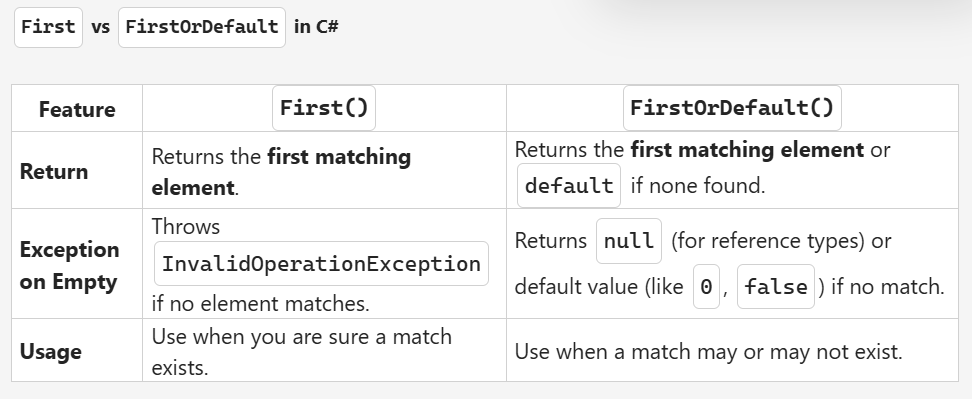

# Day 12

## Topics

- Jagged Array
- Multi Dimensional Array
    - https://learn.microsoft.com/en-us/dotnet/csharp/language-reference/builtin-types/arrays

- Collections
    - https://learn.microsoft.com/en-us/dotnet/standard/generics/collections
- Linq and lamda expressions

- Task based on these topics (Console Based application for managing employee promotion and details with `crud operations (console based)`)

## First vs FirstOrDefault

